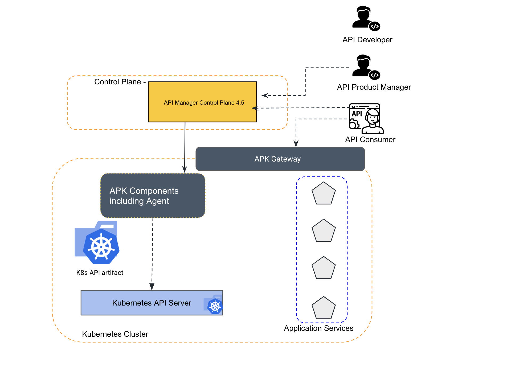
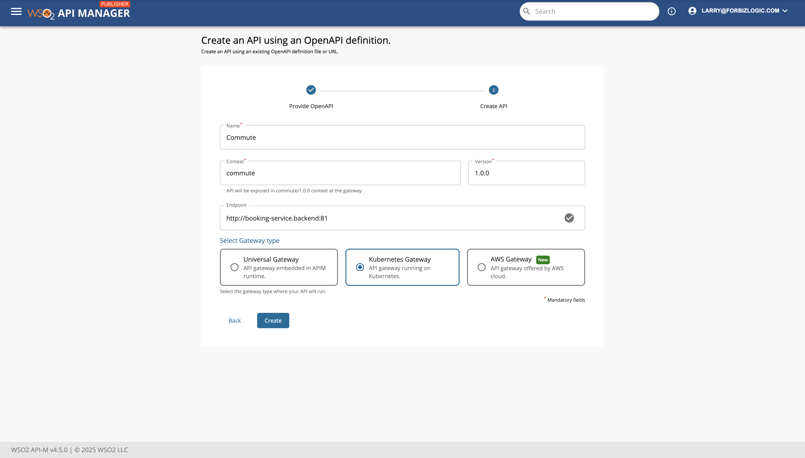
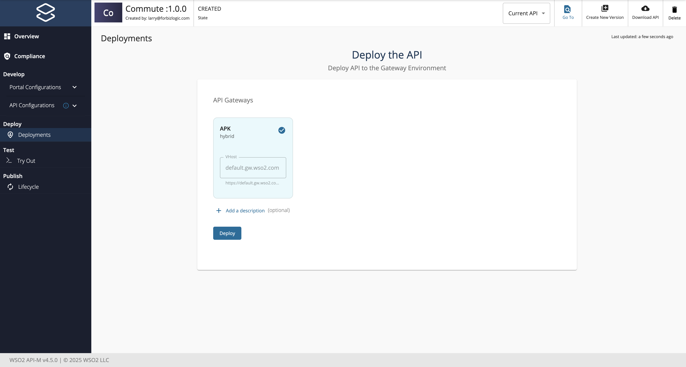
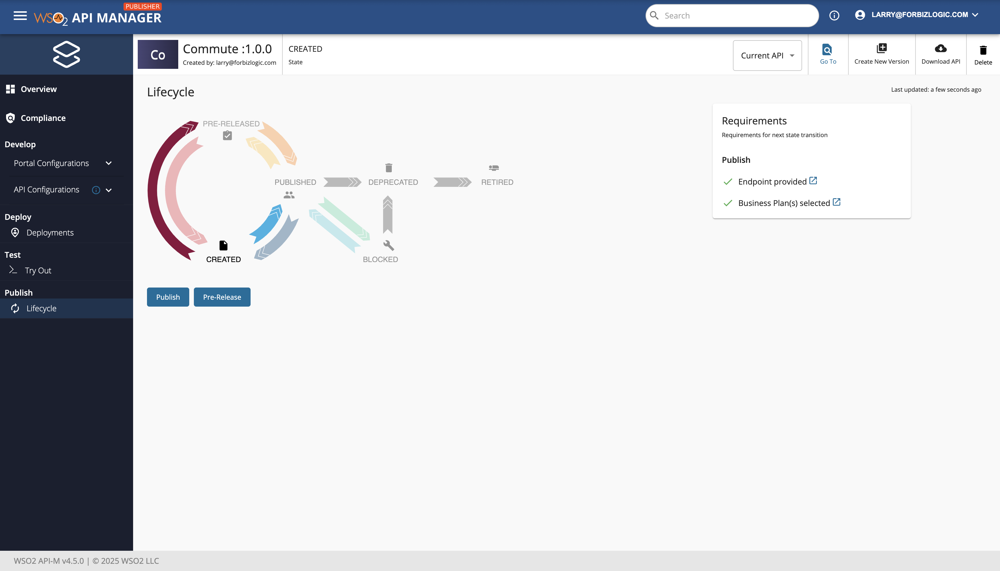
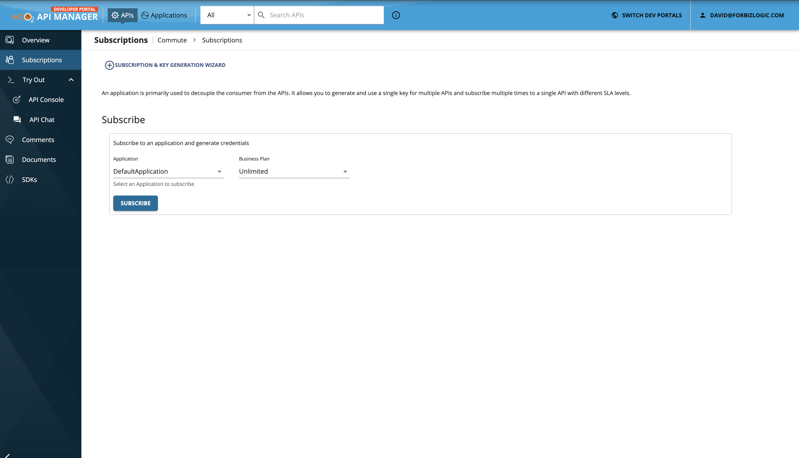
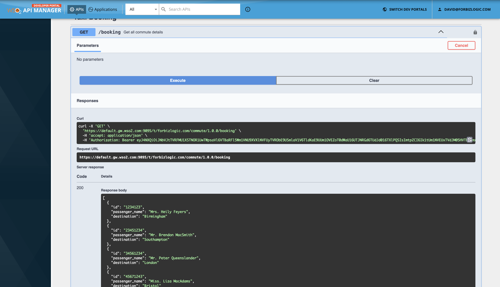

# Prerequisites

1. [Setup a Kubernetes Cluster](https://kubernetes.io/docs/setup).
2. [Install the Kubernetes Client (kubectl)](https://kubernetes.io/docs/tasks/tools/install-kubectl/).
3. [Install Helm](https://helm.sh/docs/intro/install/).

To successfully deploy WSO2 Kubernetes Gateway in your environment, it's essential to meet certain minimum requirements. These requirements ensure that the deployment process is smooth, and the platform operates efficiently.

To check the minimun requirement according to your setup follow [Minimum Requirement](https://apk.docs.wso2.com/en/latest/setup/prerequisites/).

# Install Kubernetes Gateway with Central Control Plane

Please follow guide to installing an APK with Control Plane [Setup](https://apk.docs.wso2.com/en/latest/control-plane/apk-as-gateway-in-apim/apk-as-gateway-in-apim-qsg/)

# API Development Flow

[](resources/demo.png)

## Step 1 - Create the Backend

Prior to invoking the API, you will need to have this backend up. 

We have provided the file containing this sample backend [here](/apk/resources/backend.yaml). Download it and create the backend service using the following command.

```
kubectl apply -f backend.yaml -n backend
```

Wait for this pod to spin up. You can check its status using the following command.

```
kubectl get pods -n backend
```

## Step 2 - Access thorugh localhost

1. To access the deployment through your local machine"

    Port forward gateway service to localhost.
        ```console
        kubectl port-forward svc/apk-wso2-apk-gateway-service 9095:9095
        ```

2. Add a hostname mapping to the ```/etc/hosts``` file as follows.

    | IP        | Domain name         |
    | --------- | ------------------- |
    | 127.0.0.1 | api.am.wso2.com default.gw.wso2.com idp.am.wso2.com carbon.super.gw.wso2.com  am.wso2.com|

## Step 3 - Depoly API from APIM Central Control Plane

1. Save and download the sample [CommuteService.json](/apk/resources/CommuteService.json) file. This is the OAS definition of the API that we are going to deploy in Kubernetes Gateway.

2. Login to APIM Publisher Portal
   Publisher URL - https://am.wso2.com/publisher

3. Go to the Create an API section, then navigate to the Import API section, and add the JSON file."
  [](resources/importAPI.png)

4. Select Kubernetes Gateway and click Create.
  [](resources/select.png)

5. Go to deployment section and select Gateway and click Deploy.
  [](resources/deploy.png)

6. Execute the command below. You will be able to see that the `CommuteServiceAPI` is successfully deployed as shown in the image.

    ```
    kubectl get apis -n apk
    ```
7. Got to Lifecycle section and Publish it.
   [](resources/publish.png)

## Step 4 - Subscribe and Invoke API.

Devportal URL - https://am.wso2.com/devportal

Go to developer portal and you can see the API There.
Then go to subscription and subcribe to the API.

[](resources/subscribe.png)

Tryout API
Go to tryout console and generate a production token with test token button.

[](resources/tokenGen.png)


Finally Invoke API

[](resources/invoke.png)


